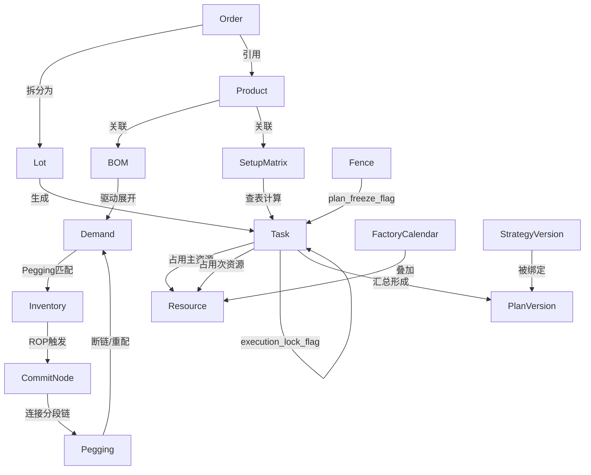

# APS高级计划与排程系统 - 总体方案设计（增强版）

> 基于《APS_需求澄清文档_v2.3_澄清层增强版》生成 | 版本：v2.0 | 状态：待方案评审

## 变更记录

| 版本 | 日期 | 修订人 | 主要变更 |
|------|------|--------|----------|
| v1.0 | 2026-02-05 | 用户/Cascade | 初版方案输出；补充方案级口径与V1边界；统一格式与补充附录 |
| v2.0 | 2026-02-21 | 用户/Cascade | 对标Asprova架构+离散机械制造行业深度审查；补充Lot层级、SetupMatrix、Link Type、计划冻结vs执行锁定语义区分、资源层级、解耦点、预警分级、排程方向规则、粗/细排分界、实绩触发重排、有效产能效率矩阵、最晚需料时间、并行资源、产能预留、计划稳定性主动控制、跨工厂承诺节点协议、计算模式标记等关键缺口 |

---
 
## 1. 方案摘要
 
### 1.1 目标与范围
 
| 维度 | 内容 |
|------|------|
| **核心目标** | 建设有限产能APS（Asprova式：一套计划结果 + 多视图），支撑日7000单规模滚动排程；未来3天可下发/冻结（时分精度），未来90天输出协同视图（按日/周/月桶聚合）；15分钟内完成全量计算 |
| **方案范围** | 计划域（滚动排程+版本管理+冻结/发布）、策略域（可配置规则矩阵）、计算域（有限产能排程+ATP/CTP）、协同域（跨工厂联动+Pegging）、展示域（甘特图+解释性输出+PSI/负荷视图） |
| **成功标准** | ① 7000单/15分钟性能达标或降级策略可配置；② 区间型计划输出落地；③ 插单ATP≤5分钟；④ 6个典型用例全通过 |
| **关键权衡** | 全量精排 vs 关键路径/分域/分批计算（降级策略）；区间型计划理解成本 vs 计划稳定性收益；合批效率 vs 交期满足率 |
#### 1.1.1 多目标优化的分阶段落地路线（补充：MVP分阶段）
 
- MVP1：交期/紧急度为主目标（可解释排序）
- MVP2：引入换型/合批倾向（减少换型、提升瓶颈利用率）
- MVP3：引入库存/在库风险（抑制过度合批与过量生产）
- MVP4：权重可配置 + what-if对比（策略版本对比）
 
### 1.2 关键方案决策点（必须拍板项，≤12条）
 
| 序号 | 决策点 | 选项A（推荐） | 选项B（备选） | 建议决策方 |
|------|--------|--------------|--------------|------------|
| D-01 | 计划视图口径（执行/协同） | 未来3天执行计划（可下发/冻结，时分精度）+未来90天协同视图（PSI/负荷按日/周/月桶） | 仅保留执行视图，不输出PSI/负荷（不推荐） | 计划员/业务负责人 |
| D-02 | 有限产能计算范围V1 | Must：资源日历+路线+工时+模具；Should：并行资源+替代设备 | 仅Must项，Should延后 | 计划员/制造/IT |
| D-03 | Fence三段参数默认值 | Frozen N=3天，Firm M=7天 | N=1天，M=3天（更激进） | 计划员/车间主任 |
| D-04 | Fence内插单仲裁规则 | 保护SO>VIP>SS-U>SS；可牺牲交期晚+影响小的订单 | 仅输出冲突，人工选择牺牲对象 | 车间主任/计划员 |
| D-05 | Pegging绑定粒度 | 批次级绑定（支持追溯），断链保留前后链路解释 | 订单级粗绑定 | 计划员/IT |
| D-06 | 区间型计划MES下发口径 | V1：下发"建议时间+冻结标记"；时间窗用于分析 | 直接下发完整区间 | 计划员/MES负责人 |
| D-07 | 性能不达标降级策略 | 关键路径精排/分批计算（保持3天冻结执行口径） | 分域并行（按工厂/产品族拆分） | IT/开发/计划员 |
| D-08 | 采购承诺边界 | 不做供应商CTP，做可用时间推算+采购建议 | 扩展至供应商产能级CTP | 采购/计划员/IT |
| D-09 | 多目标优化权重固化方式 | 按产品族配置初值，允许仿真调参 | 全局统一权重 | 计划员/业务专家 |
| D-10 | 断链自动重配 vs 仅预警 | 自动重配+保留解释链路+输出预警 | 仅标记断链，人工重配 | 计划员/IT |
| D-11 | 合批冲突时的系统行为 | 输出风险提示+影响范围；冲突必须输出影响清单与替代方案（不合批/延迟/加班） | 强制执行合批或强制拆分 | 计划员/制造 |
| D-12 | 计划版本保留策略 | 保留最近1周+手动标记保留的重要版本 | 保留最近2周自动清理 | IT/计划员 |

#### 1.2.1 合批策略的决策框架（补充：方案级）
 
- 合批收益：减少换型、提升效率、提升瓶颈利用率
- 合批成本：增加在制/库存、挤占产能导致其他紧急需求延期
- 风险约束：Firm/Frozen内SO/SS-U交期风险不得显著上升；冲突必须输出影响清单与替代方案

### 1.3 关键决策点快速索引（对应D-01~D-12）
 
 | 决策点 | 章节定位 | 推荐选项（摘要） | 主要影响范围 |
 |--------|----------|------------------|--------------|
 | D-01 计划视图口径（执行/协同） | 3.1 Step 8/9 | 3天执行冻结（可下发）+90天协同视图（按桶） | 计划稳定性、跨部门口径一致性、风险前置暴露 |
 | D-02 有限产能计算范围V1 | 2.3/7.3/8章 | Must先行，Should迭代 | 性能、数据准备成本、验收边界 |
 | D-03 Fence三段参数默认值 | 1.2/3.2/10/11 | Frozen N=3天，Firm M=7天 | 稳定性、插单可操作性、审批压力 |
 | D-04 Fence内插单仲裁规则 | 3.2/10/11 | 保护SO>VIP>SS-U>SS | 决策速度、跨部门冲突、产线执行成本 |
 | D-05 Pegging绑定粒度 | 2.4/3.5 | 批次级绑定 | 可解释性、断链追溯粒度、数据量 |
 | D-06 区间型计划MES下发口径 | 3.1 Step 9/6.3/10 | 单点建议时间+冻结标记；时间窗用于分析 | MES对接复杂度、执行一致性、复盘口径 |
 | D-07 性能不达标降级策略 | 2.3/8章 | 关键路径/分批/分域并行 | 性能达标路径、结果质量与稳定性 |
 | D-08 采购承诺边界 | 2.3/6.3/10/11 | 不做供应商CTP；做可用时间推算+采购建议 | 采购协同范围、期望管理 |
 | D-09 多目标优化权重固化方式 | 1.1/8章 | 按产品族配置初值，允许仿真调参 | 结果可解释性、运营治理、策略版本管理 |
 | D-10 断链自动重配 vs 仅预警 | 3.5/2.4 | 自动重配+保留解释链路 | 响应速度、稳定性、复盘能力 |
 | D-11 合批冲突时系统行为 | 1.2/8.2 | 必须输出影响清单+替代方案 | 计划员决策效率、风险可视化 |
 | D-12 计划版本保留策略 | 2.1 | 最近1周+手动保留关键版本 | 存储成本、追溯能力、复盘效率 |
 
 ---
 
## 2. 总体方案结构（APS五域分层）
 
### 2.1 计划域
 
| 模块 | 职责 | 与需求用例对应 |
|------|------|----------------|
| **滚动计划管理器（执行/协同视图）** | 以单一计划结果为事实源：管理计划版本、未来3天冻结/发布、以及未来90天协同视图（按日/周/月桶聚合）；支持偏离检测与稳定性指标 | UC-001~006（计划管理基础） |
| **计划版本管理器** | 创建/保存/对比/采纳/发布/回滚计划版本；版本与策略配置绑定；保留最近1周 | UC-003仿真、UC-001~002排产 |
| **发布与冻结控制器** | 确认后下发MES；锁定Frozen期资源；生成冻结标记 | UC-001~006发布环节 |
| **复盘分析器** | 计划vs实际对比；偏差分析（交付/配套/效率）；趋势报表 | 需求11.2复盘报表 |
 
### 2.2 策略域
 
| 模块 | 职责 | 与需求用例对应 |
|------|------|----------------|
| **策略配置矩阵** | 按【订单类型×产品族×工厂/产线】配置14项策略（排程方向/Pegging深度/合批策略等） | 第8章策略配置 |
| **策略版本管理器** | 保存多组策略配置为版本；what-if仿真时选择策略版本对比；策略回滚 | 8.2策略版本管理 |
| **规则引擎** | JSON格式约束规则解析与生效；规则校验工具 | 8.1策略配置清单 |
#### 2.2.1 规则引擎与参数边界控制器的职责边界（补充：方案级）
 
为实现“可配置排程逻辑”且确保版本可复现，规则与参数职责边界如下：
 
- **规则引擎（Rule Engine）**：负责“条件-动作”的路由与约束表达，例如订单类型识别、Step Flow路由、禁配/必配校验、跨工厂传导开关、异常触发条件等。输出：流程模板选择结果 + 强制约束集合。
- **参数边界控制器（Parameter Boundary Controller）**：负责“阈值/权重/窗口”的参数化输入与生效维度，例如Fence N/M、优先级权重、合批阈值、滚动窗口、降级触发门槛等。输出：参数快照（含版本号、生效维度）。
- **统一注入点（关键要求）**：每次排程计算开始前必须先完成“策略加载”，将【规则结果 + 参数快照】作为同一版次输入注入排程引擎，保证可追溯、可复现、可回滚。
 
| **参数边界控制器** | N/Fence长度/优化权重等参数生效维度控制 | 4.5.1 Fence三段定义 |
 
#### 2.2.2 产能预留/软隔离机制（补充：V1）

在MTO/MTS混合模式下，绝对优先级（SO > SS-U > SS）若不加约束会导致MTS产品长期断料。V1引入**产能预留（Capacity Reservation）**机制：

- **配置维度**：按`资源组/产线 × 订单类型`配置产能分配比例，例如"某产线40%产能优先保障SS主干产品，60%响应SO/SS-U"
- **生效规则**：排程引擎在分配资源时，先检查各类型产能预留额度；SS订单在预留额度内不被SO自动抢占，超出额度部分仍遵循优先级规则
- **V1边界**：产能预留为`Should`项，V1可先以全局比例配置，V2细化到产品族维度
- **验收口径**：配置产能预留后，SS主干产品的计划交付率不得因SO插单而低于配置前水平

#### 2.2.3 计划稳定性主动控制（补充：V1）

计划稳定性不只是事后度量（见8.2），还需要在排程时**主动抑制不必要的计划变动**：

- **稳定化权重（Stability Weight）**：在多目标优化中加入"与上一版本偏差最小化"作为目标之一，权重可按产品族/资源组配置
- **生效规则**：排程引擎在满足交期/配套率目标的前提下，优先保持与上一版本相同的资源分配和工序顺序；仅当偏差可带来显著收益时才允许变动
- **稳定化权重纳入D-09**：多目标优化权重维度扩展为：交期满足率权重 + 配套率权重 + 效率权重 + **稳定化权重**
- **V1边界**：稳定化权重为`Should`项，V1默认值为中等（防止计划剧烈抖动），可配置

### 2.3 计算域
 
| 模块 | 职责 | 与需求用例对应 |
|------|------|----------------|
| **BOM按需展开器** | 库存满足则剪枝；支持3-8级BOM；生成下层需求 | UC-001剪枝、UC-002完全展开 |
#### 2.3.1 深BOM（>8级）存在时的V1口径（补充：按需展开）
 
V1允许存在10级甚至更深BOM，但不要求全量展开为可排程任务网络，采用“按需展开”策略：
 
- 需求驱动展开：仅对本次参与排程的订单相关物料展开；
- 库存满足剪枝：上层需求在可用库存满足时允许停止向下展开（剪枝）；
- 关键路径/风险物料可强制展开：对长周期/稀缺/瓶颈相关物料允许强制展开到指定层级；
- 验收口径：V1确保“齐套判断可解释、缺料原因可追溯”，不以“全层级生成任务网络”为验收目标。

| **齐套检查器** | 自制件（库存+在制预计可用）+采购件（库存+在途+供应商库存）齐套计算 | UC-001~002齐套检查 |
| **有限产能排程引擎** | 多目标优化（交期/配套率/效率）；输出区间型计划（最早-最晚时间窗） | UC-001~006核心排程 |
| **ATP/CTP评估器** | 5分钟内完成插单可承诺性评估；输出影响分析与可选方案 | UC-003插单、UC-004紧急补库 |
#### 2.3.2 ATP / CTP 的定义与边界（补充：统一口径）
 
为避免把“评估流程”误解为“引擎已实现”，ATP/CTP口径在V1明确如下：
 
- **ATP（Available-to-Promise）**：基于现有库存 + 在制/在途供给 + 提前期，给出可承诺交付时间（或不可承诺原因）。
- **CTP（Capable-to-Promise）**：在ATP基础上进一步考虑企业内部有限产能约束（资源日历/工时/瓶颈/换型/关键模具等），给出最早可行交付时间/时间窗。

V1边界：
1) **不做供应商产能承诺级CTP**（不对供应商做有限产能排程），仅使用供应商库存/在途/提前期参与ATP；
2) CTP优先用于“Fence内插单影响评估”场景，输出必须包含“不可承诺原因分类”（产能不足/关键物料缺口/断链/冻结区限制/人工调整等）。

| **What-if仿真器** | 复制基线版本+调整策略参数；生成新版本；多版本指标对比 | 需求what-if仿真 |
| **降级策略控制器** | 性能不达标时触发：远期粗排+近期精排/关键路径精排/分域计算 | 13.1.1性能降级策略 |
| **偏差检测器** | 实时监控计划vs实绩偏差；超阈值触发事件驱动滚动排程 | X.17~X.18实绩容错 |

#### 2.3.3 排程方向规则（补充：V1 Must — 核心算法规则）

排程方向是Asprova式排程的核心机制，V1必须明确以下规则：

1. **默认倒排（JIT拉动）**：从订单需求日期向前倒排，确定各工序最晚开工时间
2. **撞墙切换正排**：若倒排计算的某工序开工时间 ≤ 今天（Time=0），则该工序及其所有前置工序强制切换为正排，从今天起寻找最早可行时间（Earliest Start）
3. **浮动空间（Float）检查**：正排找到最早完工时间后，计算与需求日期的差值（Total Float）；若Float > 0，标记为"可按时交货"；若Float < 0，标记为"预计延误 + 延误天数"
4. **关键路径决定装配开工时间**：同一装配订单的多个组件，以最晚完工的组件（关键路径）决定装配工序的最早开工时间；非关键路径组件的开工时间随关键路径推迟（避免WIP积压）
5. **工序连接类型（Link Type）**：工序间连接支持以下类型（V1 Must：ES；Should：EE/SS/SE + Min/Max Time）：
   - `ES（End-to-Start）`：前工序完工后，后工序才能开工（默认）
   - `EE（End-to-End）`：前工序完工后X时间，后工序必须完工
   - `SS（Start-to-Start）`：前工序开工后X时间，后工序才能开工（支持转移批量/重叠生产）
   - `SE（Start-to-End）`：前工序开工后X时间，后工序必须完工
   - `Min Time`：工序间最短间隔（如热处理冷却时间）
   - `Max Time`：工序间最长间隔（如防止WIP在制超时，控制在制品积压）

**验收口径**：对任一组件缺料导致的延误，系统必须输出"关键路径组件 + 最早可行交期 + 延误天数"，不得仅输出"缺料"。

#### 2.3.4 粗排/细排精度分界（补充：V1 Must — 常态化精度分层）

粗/细排切换是**常态化的精度分层机制**，不只是性能降级时才触发：

| 时间区间 | 排程精度 | 占用逻辑 | 输出粒度 |
|---------|---------|---------|---------|
| Frozen + Firm Zone（近期 N+M 天） | **机台级细排** | 在具体设备的有效日历上寻找连续空白时间窗（俄罗斯方块逻辑），时分精度 | 机台级甘特图、派工清单 |
| Open Zone（远期，Firm之外） | **资源组级粗排** | 按资源组总可用工时做负荷累加（水桶逻辑），日/周桶精度 | PSI视图、负荷/瓶颈视图 |

- **切换点**：以Firm Zone边界为分界，Firm Zone之外的订单自动采用资源组级粗排
- **统一数据视图**：两种精度的结果在同一计划版本中呈现，对外口径一致
- **`bucket_type`字段**：每条Task记录其所属精度类型（`DETAIL` / `ROUGH_CUT`），用于解释输出和验收
- **降级策略**（性能不达标时）：可将细排边界从Firm Zone收缩至Frozen Zone，作为性能降级选项

#### 2.3.5 缺料时排程行为口径（补充：V1 Must）

缺料不阻断排程，系统行为如下：

- **缺料继续排程**：以"最早齐套时间（Earliest Kit Time）"为约束正排，而非强制按需求日期倒排
- **输出标记**：缺料Task标记`material_shortage_flag = true`，附带`earliest_kit_time`（预计最早齐套时间）和`expected_delay_days`（预计延误天数）
- **不阻断原则**：缺料不阻止其他不缺料工序的排程继续进行
- **验收口径**：对任一缺料订单，必须输出"缺料物料编码 + 缺口数量 + 最早可用时间 + 对交期的影响天数"

#### 2.3.6 有效产能与效率系数矩阵（补充：V1 Should）

资源产能计算公式（对标需求文档X.54）：

```
Task占用时间 = Setup Time + (CT × Lot数量) / efficiency_factor
```

- **效率系数矩阵（`efficiency_matrix`）**：按`产品族/换型族群 × 资源`维度配置效率系数（0~1.0）；同一设备加工不同产品族的效率不同（如铝合金100%，钛合金60%）
- **V1边界**：效率系数为`Should`项，V1可先配置全局效率系数（默认1.0），V2细化到`产品族 × 资源`维度
- **有效产能 = 理论产能 × 效率系数**，排程引擎使用有效产能而非理论产能计算资源占用

#### 2.3.7 最晚需料时间（Latest Need Time）（补充：V1 Must）

齐套检查输出必须包含`latest_need_time`，用于精确指导采购：

- **计算逻辑**：`latest_need_time = 工序计划开工时间 - 物料准备缓冲时间（可配置）`
- **采购建议判断**：若`采购提前期 > latest_need_time - 今天`，则标记为"紧急/无法按时到货"，建议加急/空运/替代料
- **验收口径**：采购建议中必须包含`latest_need_time`字段；对每个缺料物料，输出"最晚需料时间 + 当前预计到货时间 + 是否可按时到货"

#### 2.3.8 实绩触发事件驱动重排（补充：V1 Should）

滚动排程不只是定时触发，还需要支持**实绩偏差触发**：

- **偏差检测**：`偏差检测器`持续监控MES实绩回写，检查`实际完工时间 vs 计划完工时间`
- **触发条件（可配置）**：① 关键路径工序延误超过X小时；② 瓶颈资源实际完工偏差超过Y%；③ 缺料状态变化（到货/断料）
- **实绩容错口径**：超时未报工（超过Z小时）则标记为`status = UNKNOWN`，触发预警，不自动假设完工；可配置"超时X小时后按计划完工处理"作为降级选项
- **V1边界**：定时滚动为`Must`，事件驱动重排为`Should`

### 2.4 协同域
 
| 模块 | 职责 | 与需求用例对应 |
|------|------|----------------|
| **跨工厂需求传导器** | 装配需求穿透至型材工厂；考虑物流时间；跨工厂资源协同 | UC-005跨工厂链路 |
| **Pegging管理器** | 供需匹配关联；批次级绑定；断链检测与自动重配；保留断链前后链路 | 4.4 Pegging术语、4.4.1断链处置 |
#### 2.4.1 跨工厂Pegging边界与链路形态（补充：方案级口径）
 
为避免跨工厂协同在数据模型与排程引擎实现上出现分歧，跨工厂Pegging链路形态在V1明确如下：
 
- **默认：端到端单链（E2E Chain）**  
  同一条需求从装配→加工→（铸造/押出/外协/采购）形成一条可追溯的Pegging链路（同一 ChainId），用于解释输出与版本对比。

- **允许：分段链（Segment Chain），但必须可拼接**  
  若上游工厂暂无法端到端统一计算，则以“交付承诺节点（Commit Node）”连接上下游分段；在解释输出中必须可拼接展示端到端路径，并能定位断链发生在哪一段。

- **链路稳定性**  
  Frozen Zone 内原则上不自动重绑；若发生断链（挪用/冻结/延迟/人工调整），必须保留断链前后两条链路用于复盘与对比。

| **预警与解释器** | 延期风险/缺料/瓶颈预警；解释性输出（为什么这么排/谁占用库存/断链原因） | 需求风险预警、可解释性 |
| **采购协同接口** | 小时级同步供应商库存+在途；输出采购建议（加急/分批/替代料） | 采购承诺能力边界 |

#### 2.4.2 库存解耦点原则（补充：V1 Must）

在有多级MTS缓冲库存的多工厂/多工艺段环境中，排程逻辑必须在各MTS仓库处"切断"需求穿透：

- **解耦点定义**：各MTS缓冲仓库（如机加工段半成品库、装配段成品库）是需求传导的切断点
- **下游视线**：装配层只消耗机加工段MTS库存，不直接穿透指挥机加工排产
- **触发机制**：当MTS库存低于再订货点（ROP）时，自动生成对上游的SS-U补库需求，而非直接排程指令
- **独立需求 vs 相关需求**：`Demand`对象增加`demand_type`字段：`INDEPENDENT`（SO/SS直接需求）和`DEPENDENT`（BOM展开的相关需求）；解耦点处的需求类型从`DEPENDENT`切换为`INDEPENDENT`
- **与全链路Pegging的关系**：解耦点处Pegging链路分段，上下游形成`CommitNode`连接（见2.4.3），而非强制端到端穿透
- **V1边界**：解耦点配置为`Must`项，支持按工厂/工艺段配置MTS缓冲水位（ROP）和补库触发规则

#### 2.4.3 跨工厂承诺节点协议（补充：V1 Should）

跨工厂协同通过`CommitNode`（承诺节点）协议协调上下游，避免实时穿透导致上游计划频繁被打乱：

**CommitNode对象**：

| 字段 | 说明 |
|------|------|
| `commit_id` | 承诺节点唯一标识 |
| `upstream_factory` | 上游工厂/工艺段 |
| `downstream_factory` | 下游工厂/工艺段 |
| `item_code` | 承诺物料编码 |
| `committed_qty` | 承诺数量 |
| `committed_time` | 承诺交付时间 |
| `time_precision` | 时间精度（日/班次/小时） |
| `status` | 状态：`VALID`/`AT_RISK`（预警）/`BREACHED`（违约） |
| `pegging_chain_id` | 关联的Pegging链路ID |

- **下游以CommitNode为约束**：下游工厂排程时以`committed_time`为物料可用时间，不实时穿透上游排程细节
- **变更通知**：上游工厂修改承诺时，`status`更新为`AT_RISK`或`BREACHED`，触发下游预警
- **V1边界**：CommitNode为`Should`项，V1可先以"物流提前期参数"替代，V2升级为完整CommitNode协议

#### 2.4.4 预警分级与静默期机制（补充：V1 Must）

预警必须分级，防止计划员被"假性缺料预警"淹没：

| 预警级别 | 触发条件 | 处理方式 |
|---------|---------|---------|
| **高优（立即推送）** | Frozen/Firm Zone内异常（缺料/断链/延误/资源冲突） | 立即推送EAS + 邮件/消息通知 |
| **中优（报表展示）** | Open Zone内SS断链、远期负荷超载（>90天） | 仅在报表/看板中展示，不主动推送 |
| **低优（静默）** | 远期SS预测偏差、超过90天的缺口 | 静默记录，不展示 |

- **升级触发**：中优预警在进入Firm Zone前X天（可配置）仍未解决时，自动升级为高优并推送
- **降噪配置**：可按`预警类型 × 时间区间 × 订单类型`配置静默规则
- **验收口径**：高优预警推送率 ≥ 99%；中优预警不得主动推送EAS（防止噪音）

### 2.5 展示域
 
| 模块 | 职责 | 与需求用例对应 |
|------|------|----------------|
| **甘特图可视化** | 机台/产线级时间轴；区间标记；依赖关系；拖拽调整 | 需求甘特图交互 |
| **版本对比界面** | 多版本交付率/配套率/效率指标对比；差异高亮 | 需求版本对比 |
| **解释性输出页面** | 计划结果约束追溯；Pegging链路展示；变更原因摘要 | 可解释性需求 |
#### 2.5.1 ExplainTrace 解释追溯记录（补充：V1最小字段集合）
 
为支撑跨部门协同、插单挪用解释与复盘，系统必须输出解释追溯记录（V1最小集合）：
 
- decision_id：本次决策/重排唯一标识（关联计划版本）
- applied_rules：命中关键规则摘要（路由/插单/Fence/合批等）
- applied_parameters：关键参数快照（N/M、权重、阈值、窗口、降级模式）
- bottleneck_resource：主要瓶颈资源/冲突点摘要
- material_lock_trace：物料占用/锁定链路摘要（含是否被挪用）
- pegging_chain_trace：Pegging链路（端到端或分段承诺节点）
- conflict_and_resolution：冲突与解法（加班/外协/牺牲对象/延迟原因）
- plan_change_reason：变更原因分类（插单/断链/冻结/人工调整/状态变化）
- impacted_orders_topN：影响订单清单（Top N + 总数）

验收口径：对任一缺货/延期，必须输出“原因分类 + 影响范围 + 可追溯线索”。

| **监控看板** | 资源负荷率；瓶颈标识；实时预警推送 | 需求执行监控 |

---
 
## 3. 关键流程方案
 
### 3.1 主流程：滚动排程（Asprova式：一套计划结果 + 多视图）（对应UC-001~002）
 
```
[触发] 每日定时（建议08:00）+事件触发（插单/资源状态变化/关键物料到货变化等）或人工触发
  │
  ├─ Step 1: 数据同步与校验
  │     ├─ ERP：订单/BOM/库存/工单
  │     ├─ MES：工艺路线/设备产能/模具状态
  │     └─ 采购系统：供应商库存/在途量（小时级缓存）
  │
  ├─ Step 2: 策略配置加载
  │     ├─ ERP：订单/BOM/库存/工单
  │     ├─ MES：工艺路线/设备产能/模具状态
  │     └─ 采购系统：供应商库存/在途量（小时级缓存）
  │
  ├─ Step 2: 策略配置加载
  │     ├─ 按【订单类型×产品族×工厂】加载策略矩阵
  │     ├─ 加载约束规则JSON
  │     └─ 确定：排程方向/Pegging深度/合批策略/Fence参数等
  │
  ├─ Step 3: BOM按需展开（剪枝策略）
  │     ├─ 逐层检查库存可用量
  │     ├─ 满足则停止展开（剪枝）
  │     └─ 不满足则继续下层，生成子需求
  │
  ├─ Step 4: 齐套检查
  │     ├─ 自制件：库存 + 在制预计可用时间
  │     ├─ 采购件：库存 + 在途预计到货 + 供应商库存
  │     └─ 输出：齐套结果 + 缺口清单 + 预计可用时间
  │
  ├─ Step 5: 有限产能排程（核心计算）
  │     ├─ 加载资源日历（班次/停机/维护）
  │     ├─ 应用约束规则（Must：路线/工时/产能/模具/Fence保护）
  │     ├─ 多目标优化（交期/配套率/效率按权重权衡）
  │     ├─ 输出区间型计划：最早/最晚/建议时间
  │     └─ Pegging绑定：记录供需匹配关系
  │
  ├─ Step 6: 跨工厂协同（如适用）
  │     ├─ 装配需求传导至上游工厂
  │     ├─ 上游工厂独立排程后回传
  │     ├─ 校验：上游完工 + 物流时间 ≤ 下游开工
  │     └─ 输出：跨工厂联动计划
  │
  ├─ Step 7: 结果汇总与版本生成（单一计划结果）
  │     ├─ 合并各层级计划
  │     ├─ 计算指标：交付率/配套率/效率
  │     ├─ 生成计划版本（含策略配置绑定）
  │     └─ 输出：甘特图数据 + 区间型计划 + 指标报告
  │
  ├─ Step 8: 视图输出（近期执行+远期协同）
│     ├─ 近期执行视图（未来3天，时分精度）：机台级甘特图 + 近3天派工清单 + 交期风险清单 + 占用/锁定解释记录
│     └─ 远期协同视图（未来90天，按日/周/月桶聚合）：PSI（需求-供给-库存）+ 资源负荷/瓶颈 + 缺料/交付风险预警
│
├─ Step 9: 人工确认与发布（冻结/下发窗口=未来3天）
│     ├─ 计划员查看甘特图 + 指标 + 风险清单
│     ├─ 可拖拽调整（触发局部重排，生成新版本）
│     ├─ 确认后发布：冻结未来3天任务/资源/关键物料占用
│     └─ 下发MES：建议时间（单点计划）+ 冻结标记（freeze_flag）
  │
  └─ Step 10: 锁定与同步
        ├─ Frozen期资源锁定（不可自动抢占）
        ├─ 更新库存预留
        ├─ 回写ERP：计划时间/状态
        └─ 触发MES执行
```

### 3.2.1 异常流程：Fence内插单处理（对应UC-003）

```
[触发] VIP客户紧急SO，需求日期在Frozen期内
  │
  ├─ Step 1: 快速标记与初筛（30秒内）
  │     ├─ 标记插单类型（SO/SS-U）
  │     ├─ 快速BOM展开（仅关键路径）
  │     └─ 初步齐套检查
  │
  ├─ Step 2: Fence判断
  │     ├─ Frozen Zone（N天内）：进入ATP评估
  │     ├─ Firm Zone（N+M天内）：允许有限调整
  │     └─ Open Zone：正常重排
  │
  ├─ Step 3: 先寻找产能白地（不打乱现有计划的最早交期）
  │     ├─ 在Open Zone寻找最早可行产能窗口（不占用任何Frozen/Firm资源）
  │     ├─ 考虑单物料约束：先推算关键物料最早可用时间，再正排寻找设备空位
  │     ├─ 输出：方案A — "最早可行交期（不打乱计划）+ 原因说明"
  │     └─ 若方案A交期可接受：直接进入Step 5人工确认，跳过Step 4
  │
  ├─ Step 4: CTP影响评估（仅当客户不接受方案A时触发）
  │     ├─ 识别资源冲突（设备/物料）
  │     ├─ 识别受影响订单清单（受害者清单）
  │     ├─ 计算三种方案：占用冻结资源 vs 加班 vs 外协
  │     └─ 输出：方案B/C/D + 各方案影响范围对比
  │
  ├─ Step 4b: 仲裁与决策支持
  │     ├─ 若选择"占用冻结资源"（不加班不外协）：
  │     │     ├─ 按保护顺序识别可牺牲订单：SS优先，SS-U次之
  │     │     ├─ 优先牺牲：交期晚 + 影响小 + 替代供给可能高
  │     │     ├─ 若必须牺牲SO：触发审批流
  │     │     └─ 输出：被挤占清单 + 影响分析 + 建议决策路径
  │     ├─ 若选择"加班"：检查设备/人员加班可行性
  │     └─ 若选择"外协"：标记外协需求，转采购评估
  │
  ├─ Step 5: 人工决策确认
  │     ├─ 计划员/车间主任查看影响分析
  │     ├─ 选择方案并确认（或驳回插单）
  │     └─ 记录决策原因
  │
  ├─ Step 6: 重排与版本生成
  │     ├─ 按决策方案重排（局部重排或全量重排）
  │     ├─ 生成新版本（保留原版本用于对比）
  │     ├─ 输出：计划变更原因摘要
  │     └─ Pegging更新：断链检测与重配
  │
  └─ Step 7: 发布与预警
        ├─ 确认后发布新版本
        ├─ 向受影响订单相关方推送变更通知
        └─ 更新冻结期资源占用
```

### 3.3.1 异常流程：SS-U紧急补库（对应UC-004）

```
[触发] 零部件库存低于安全库存，触发断料预警
  │
  ├─ Step 1: 自动生成SS-U订单
  │     ├─ 计算补库数量（至目标库存）
  │     ├─ 标记高优先级（仅次于SO）
  │     └─ 记录触发原因（断料风险/客户投诉等）
  │
  ├─ Step 2: 资源抢占评估
  │     ├─ 识别当前被SS占用的资源
  │     ├─ 评估抢占对SO的影响
  │     └─ 输出：可抢占资源清单 + SO影响预警（如有）
  │
  ├─ Step 3: 计划员确认
  │     ├─ 查看SS-U合理性
  │     ├─ 确认抢占方案或调整
  │     └─ 若影响SO，需升级审批
  │
  └─ Step 4: 重排与发布
        ├─ 优先排产SS-U
        ├─ 被抢占SS延后或调整
        ├─ 生成新版本
        └─ 发布并预警相关方
```

### 3.4.1 异常流程：跨工厂联动排程（对应UC-005）

```
[触发] 装配工厂SO，需上游工厂（加工/型材）供给
  │
  ├─ Step 1: 需求穿透
  │     ├─ 装配SO按BOM拆解至原材料层级
  │     ├─ 识别跨工厂物料需求
  │     └─ 输出：各工厂子需求清单
  │
  ├─ Step 2: 上游工厂独立排程
  │     ├─ 型材工厂：检查库存，不足则触发生产
  │     ├─ 加工工厂：接收型材供给计划，安排加工
  │     └─ 各工厂本地排程（考虑本地约束）
  │
  ├─ Step 3: 物流时间计算
  │     ├─ 工厂间物流提前期（参数配置）
  │     ├─ 物流资源可用性（V1仅时间考虑，V2可升级资源约束）
  │     └─ 输出：预计到货时间
  │
  ├─ Step 4: 跨工厂协同校验
  │     ├─ 校验：上游完工时间 + 物流时间 ≤ 下游开工时间
  │     ├─ 若冲突：触发预警 + 调整建议（上游加班/下游延迟/物流加急）
  │     └─ 输出：跨工厂时间对齐方案
  │
  └─ Step 5: 计划锁定与同步
        ├─ 各工厂计划同步锁定
        ├─ 生成跨工厂联动计划版本
        ├─ 下发各工厂MES
        └─ 建立跨工厂Pegging链路
```

### 3.5.1 异常流程：Pegging断链处理（对应4.4.1断链处置）

```
[触发] 库存被挪用/状态变化/供给延迟/人工调整 导致Pegging失效
  │
  ├─ Step 1: 断链检测与分类
  │     ├─ 识别断链原因：挪用/冻结/延迟/人工调整
  │     ├─ 记录断链时间点
  │     └─ 标记受影响需求
  │
  ├─ Step 2: 保留断链前后链路
  │     ├─ 保存原Pegging链路（用于追溯）
  │     ├─ 记录断链前供给来源
  │     └─ 记录断链原因与责任归因线索
  │
  ├─ Step 3: 自动重配
  │     ├─ 对断链需求重新执行Pegging
  │     ├─ 遵循"库存优先+缺口补齐"规则
  │     ├─ SO > SS-U > SS优先级分配
  │     └─ 输出：新Pegging链路
  │
  ├─ Step 4: 影响评估与预警
  │     ├─ 评估断链是否导致交期风险
  │     ├─ 若风险：输出"风险预警+影响订单清单"
  │     └─ 推送预警至相关方
  │
  └─ Step 5: 解释性输出
        └─ 回答："某订单缺货是什么原因导致"
           ├─ 原因类型：挪用/冻结/延迟/人工调整
           ├─ 时间点：断链发生时间
           └─ 责任线索：谁的操作导致（操作人/系统/外部）
```
---
 

## 4. Step Flow模板包（三套）

### 4.1 SO（销售订单）Step Flow模板

| 维度 | 行为定义 |
|------|----------|
| **排序依据** | 优先级：SO为最高级（高于SS-U/SS）；同优先级内按需求日期先后排序；VIP客户可配置额外权重 |
| **资源选择倾向** | 优先选择专用设备/高精度设备；替代设备仅在主设备满载且交期紧张时考虑；优先选择历史效率高的产线 |
| **合批倾向** | 允许合批但受交期约束：若合批导致任一订单超交期，则自动拆批；合批时优先匹配交期相近的订单；输出合批建议供计划员确认 |
| **Fence与插单行为** | Frozen期内：资源默认保护，插单必须走ATP评估+审批；Firm期内：允许有限调整，需输出影响清单；Open期内：允许自由调整 |
| **输出差异** | 必须承诺交期；输出区间型计划但建议时间偏向最早开始；Pegging全链路绑定（至原材料）；风险预警优先级高 |

### 4.2 SS（计划补库）Step Flow模板

| 维度 | 行为定义 |
|------|----------|
| **排序依据** | 优先级：中等级（低于SO/SS-U）；按目标库存缺口大小排序（缺口大优先）；按补库提前期排序（提前期短优先） |
| **资源选择倾向** | 优先利用空闲产能/换型窗口；接受替代设备（配置允许时）；优先选择换型成本低的产线 |
| **合批倾向** | 积极合批：允许跨订单合批以提升效率；合批时优先考虑库存周转目标；允许适当延迟以等待合批机会 |
| **Fence与插单行为** | Frozen期内：可被SS-U/SO插单抢占资源（需评估影响）；Firm期内：允许调整，可接受延期；Open期内：允许自由重排 |
| **输出差异** | 不承诺固定交期，输出时间区间；建议时间偏向效率最优（可能非最早）；Pegging可按配置选择单层/多层；风险预警优先级中 |

### 4.3 SS-U（紧急补库）Step Flow模板

| 维度 | 行为定义 |
|------|----------|
| **排序依据** | 优先级：高等级（仅次于SO）；按断料风险等级排序（风险高优先）；按安全库存缺口大小排序 |
| **资源选择倾向** | 优先抢占SS占用的资源；必要时可抢占非关键SO的资源（需审批）；接受加班/替代设备/外协选项 |
| **合批倾向** | 紧急优先：若合批导致响应延迟则不合批；仅当物料相同且时间窗口重叠<1天时才合批；优先保障及时性 |
| **Fence与插单行为** | Frozen期内：允许抢占（触发SO影响评估）；Firm期内：允许抢占并调整SS；Open期内：自由重排；断料风险触发自动升级 |
| **输出差异** | 输出区间型计划但建议时间偏向最早完成；必须输出断料风险预警；Pegging多层绑定；输出被抢占资源清单及影响 |

---
 
## 5. 核心对象与关系（概念级）

### 5.1 核心对象清单

| 对象 | 定义 | 关键属性 | 与其他对象关系 |
|------|------|----------|----------------|
| **Order（订单）** | SO/SS/SS-U需求单 | 订单号、类型、品番、数量、需求日期、优先级、产品族 | 关联Product；拆分为Lot；参与Pegging |
| **Product（产品）** | 成品/半成品品番 | 品番编码、产品族、**setup_family（换型族群）**、BOM版本、主工艺路线版本、**替代工艺路线列表** | 被Order引用；关联BOM；关联SetupMatrix |
| **BOM（物料清单）** | 产品层级结构 | 父品番、子品番、用量、层级、工序 | 被Product引用；驱动Demand展开 |
| **Lot（批次）** | 调度最小单元；一个Order可拆为多个Lot | LotID、来源OrderID、数量、**transfer_batch_size（转移批量）**、当前工序、当前资源、状态 | 归属于Order；生成Task；支持合批/拆批/并行加工/重叠生产 |
| **Task（任务）** | 一个Lot在一道工序上的排程单元 | 任务ID、LotID、工序、**link_type（ES/EE/SS/SE）**、**min_time/max_time**、主资源ID、**次资源ID列表**、计划开始/结束时间、**plan_freeze_flag**、**execution_lock_flag**、**bucket_type（DETAIL/ROUGH_CUT）**、**compute_mode**、material_shortage_flag、earliest_kit_time | 归属于Lot；占用主资源+次资源；受Fence保护 |
| **Resource（资源）** | 设备/设备组/产线/模具/操作工 | 资源编码、**resource_type（PRIMARY/SECONDARY_FULL/SECONDARY_PARTIAL）**、**resource_level（工厂/产线/资源组/设备）**、**shift_calendar（班次日历）**、**maintenance_calendar（维护日历）**、**exception_calendar（例外日历：临时加班/停机）**、**efficiency_matrix（效率系数矩阵）**、状态 | 被Task占用；资源组聚合用于粗排负荷；参与瓶颈识别 |
| **SetupMatrix（换型时间矩阵）** | 序列相关换型时间定义 | 来源setup_family、目标setup_family、资源ID/资源组ID、换型时间（分钟） | 被排程引擎查表；影响Task的Setup Time计算；驱动排序优化 |
| **FactoryCalendar（工厂日历）** | 工厂级工作日历 | 工厂ID、法定节假日、调休安排、自定义停产日、工作日定义 | 被Resource日历叠加引用；用于自然日↔工作日转换 |
| **Inventory（库存）** | 可用供给（含在制/在途的可用时间视角） | 物料编码、数量、状态、位置、可用时间、**ROP（再订货点）**、**buffer_level（缓冲水位）** | 参与Pegging；满足Demand；触发解耦点补库 |
| **Demand（需求）** | BOM展开后的物料需求 | 需求ID、来源订单、物料编码、数量、需求时间、**demand_type（INDEPENDENT/DEPENDENT）**、**latest_need_time（最晚需料时间）** | 与Inventory通过Pegging匹配；解耦点处切换为INDEPENDENT |
| **Pegging（供需绑定）** | 需求与供给的匹配关系 | PeggingID、需求ID、供给ID、绑定数量、绑定时间、状态、断链原因 | 连接Demand与Inventory；支持断链追溯与重配 |
| **CommitNode（承诺节点）** | 跨工厂/跨工艺段的交付承诺 | commit_id、上游工厂、下游工厂、物料、承诺数量、**committed_time**、时间精度、**status（VALID/AT_RISK/BREACHED）**、pegging_chain_id | 连接跨工厂Pegging分段链；触发下游预警 |
| **PlanVersion（计划版本）** | 一次排产的结果快照 | 版本ID、生成时间、状态、指标、策略版本引用、**compute_mode（FULL_DETAIL/CRITICAL_PATH/ROUGH_CUT/DOMAIN_SPLIT）** | 包含Task集合；支持对比、采纳、发布、回滚 |
| **StrategyVersion（策略版本）** | 一组策略配置的版本化快照 | 版本ID、生效维度、参数集合、变更记录 | 被PlanVersion引用；支持对比与回滚 |
| **Fence（时间围栏）** | 计划稳定性分区 | Frozen N天、Firm N+M天、Open区 | 控制计划变更与插单行为；驱动plan_freeze_flag |

### 5.2 核心关系图（Mermaid概念）


**图例说明**：
- `-->|拆分为|`：Order拆分为多个Lot（调度最小单元）
- `-->|生成|`：Lot在每道工序生成一个Task
- `-->|占用主资源/次资源|`：Task同时占用主资源（设备）和次资源（模具/操作工）
- `-->|查表计算|`：SetupMatrix为Task提供换型时间
- `-->|叠加|`：FactoryCalendar与Resource班次日历叠加得到有效可用时间
- `-->|plan_freeze_flag|`：Fence驱动计划冻结标记（人工可审批修改）
- `-->|execution_lock_flag|`：MES回写"已开工"后设置执行锁定（修改需MES确认）

### 5.3 关键关系约束

| 关系 | 约束说明 |
|------|----------|
| Order → Lot → Task | 一个Order拆为多个Lot；一个Lot在每道工序生成一个Task；Task是排程最小执行单元 |
| Task → Resource（主+次） | 一个Task有且仅有一个主资源；可有多个次资源（模具/夹具/操作工）；主次资源必须同时可用才能开工 |
| Task.plan_freeze_flag vs execution_lock_flag | `plan_freeze_flag`：Fence驱动，人工可审批修改；`execution_lock_flag`：MES回写已开工后设置，修改需MES确认并可能产生实际损失 |
| Task.link_type | 工序间连接类型（ES/EE/SS/SE）+ Min/Max Time；V1 Must：ES；Should：其余类型 |
| Task.bucket_type | `DETAIL`（Frozen+Firm Zone细排）/ `ROUGH_CUT`（Open Zone粗排）；同一PlanVersion中两种精度共存 |
| Demand.demand_type | `INDEPENDENT`（SO/SS直接需求）/ `DEPENDENT`（BOM展开相关需求）；解耦点处从DEPENDENT切换为INDEPENDENT |
| Inventory.ROP | 当buffer_level < ROP时，自动生成SS-U补库需求（解耦点触发机制） |
| PlanVersion.compute_mode | 标记本次计划的计算模式；甘特图对非FULL_DETAIL的Task显示不同样式 |
| Fence → Task | Frozen期内`plan_freeze_flag=FROZEN`，不可自动抢占；Firm期内`plan_freeze_flag=FIRM`，有限调整需留痕 |

#### 5.3.1 物料占用与锁定（Material Lock）口径（补充：V1）

为避免“插单挪用导致原订单缺货但系统不说明原因”，V1必须具备物料占用/锁定口径：

- **占用（Allocated）**：需求已占用某物料可用量（库存/在制/在途），作为Pegging链路与解释输出依据。
- **锁定（Locked）**：在Fence约束下，对占用的可用量施加不可自动挪用的保护。

默认策略（可配置）：
1) **SO**：Firm/Frozen 内关键物料占用默认锁定；若必须挪用需审批并输出影响清单；
2) **SS**：允许在冲突时被挪用，但挪用必须输出“挪用原因=更高优先级需求/插单”；
3) **SS-U**：默认高于SS、低于关键SO；冲突时优先保护SS-U关键物料占用。

---
 
## 6. 输入/输出与集成边界

### 6.1 系统输入（来自外围系统）

| 输入 | 来源 | 内容要点 | 频率 |
|------|------|----------|------|
| **订单数据** | ERP | SO/SS/SS-U订单号、品番、数量、需求日期、优先级、客户等级、应起工日（若有） | 实时API + 定时批量 |
| **BOM与物料主数据** | ERP | BOM结构（3-8级；V1支持>8级按需展开）、用量、物料编码、替代料（若有） | 定时同步 |
| **库存数据** | ERP | 数量、状态（可用/冻结/待检/在制/在途/预留/安全库存） | 实时/准实时 |
| **工艺路线** | MES | 工序顺序、工时/节拍（CT）、资源需求、**工序连接类型（Link Type）**、**Min/Max Time**、路线版本、**替代工艺路线** | 定时同步 |
| **设备与产能数据** | MES | 设备/设备组、**资源层级（工厂/产线/资源组/设备）**、**班次日历（ShiftCalendar）**、**维护日历（MaintenanceCalendar）**、**例外日历（ExceptionCalendar：临时加班/停机）**、产能参数、状态 | 定时同步 |
| **模具状态** | MES | 模具可用性与可用时间；**模具作为次资源（SECONDARY）的占用状态** | 实时/定时 |
| **换型时间矩阵** | MES/工艺 | **SetupMatrix：换型族群（setup_family）× 资源 → 换型时间（分钟）** | 定时同步 |
| **效率系数矩阵** | MES/工艺 | **efficiency_matrix：产品族/换型族群 × 资源 → 效率系数（0~1.0）** | 定时同步 |
| **工厂日历** | ERP/HR | **FactoryCalendar：法定节假日、调休安排、自定义停产日** | 定时同步（月度） |
| **执行实绩** | MES | 开工/完工/报工、异常停机（若有）；**超时未报工触发偏差检测** | 实时推送 |
| **采购供给数据** | 采购系统 | 供应商库存（若可获取）、在途PO、预计到货、采购提前期、MOQ | API，小时级 |

### 6.2 系统输出（至外围系统）

| 输出 | 目标 | 内容要点 | 时机 |
|------|------|----------|------|
| **机台级排产计划** | MES | 工单号、工序、资源、建议开始/完成（单点计划）、**plan_freeze_flag（计划冻结）**、**execution_lock_flag（执行锁定）**、**bucket_type（DETAIL/ROUGH_CUT）**、**compute_mode** | 计划发布后 |
| **计划状态与承诺信息** | ERP | 订单/工单计划开始/完成、承诺交期（promise_date）、版本号、**compute_mode** | 确认/发布后 |
| **采购建议与缺料预警** | 采购系统/采购人员 | 缺料物料、缺口、**latest_need_time（最晚需料时间）**、当前预计到货时间、**是否可按时到货**、建议（加急/分批/替代料） | 实时/滚动后 |
| **异常告警事件** | EAS | **分级预警**（高优立即推送/中优报表展示）；延期风险/缺料/瓶颈/断链等事件与影响清单 | 实时推送（高优）/报表（中优） |

### 6.3 集成边界与责任口径

| 边界 | 口径 |
|------|------|
| APS vs ERP | ERP为订单/BOM/库存权威源；APS回写计划时间与状态，不替代ERP下单与MRP |
| APS vs MES | MES为工艺与实绩权威源；APS下发“建议单点计划+冻结标记”，时间窗用于分析，不直接作为执行指令 |
| APS vs 采购系统 | 不做供应商产能承诺级CTP；做供给可用时间推算与采购建议，不替代采购系统协同流程 |

---
 
## 7. 风险清单与对策

### 7.1 业务风险

| 风险ID | 风险描述 | 影响 | 概率 | 对策 |
|--------|----------|------|------|------|
| B-01 | 区间型计划理解成本高 | 用户接受度低，推广困难 | 中 | 时间窗可视化+“建议时间/时间窗”双视图；培训+试运行；提供解释性输出 |
| B-02 | Fence内插单仲裁规则争议 | 决策慢、跨部门冲突 | 中 | 方案评审前拍板默认保护顺序；输出影响清单与可选方案；审批机制明确 |
| B-03 | 多目标优化结果与直觉不一致 | 质疑排产结果 | 中 | 权重透明化；what-if对比；输出“权衡说明”；先单目标后多目标分阶段落地 |

### 7.2 数据与能力风险

| 风险ID | 风险描述 | 影响 | 概率 | 对策 |
|--------|----------|------|------|------|
| D-01 | 工艺路线/工时/设备日历数据不全 | Should项无法落地，结果偏差 | 中 | 数据盘点前置；为缺失数据提供降级策略；上线分产品族推进 |
| D-02 | 采购供给数据小时级延迟 | 齐套误判 | 低 | 延迟标记提示；安全库存缓冲；异常时允许人工介入与二次确认 |
| D-03 | 约束规则配置出错 | 排产异常 | 中 | 配置校验+版本控制+灰度生效；仿真验证后再采纳 |
| D-04 | **换型时间矩阵（SetupMatrix）数据缺失** | 排序优化无效，产能损失20-40% | **高** | 上线前必须完成换型族群（setup_family）分类和矩阵数据采集；V1可先用全局换型时间，V2细化到族群矩阵 |
| D-05 | **效率系数矩阵数据缺失** | 产能计算偏差，排程结果不可信 | 中 | V1先用全局效率系数（默认1.0）；通过MES实绩数据逐步校准 |
| D-06 | **MES实绩报工延迟/漏报** | 偏差检测误触发，计划稳定性下降 | 中 | 配置超时容忍阈值；超时标记UNKNOWN而非假设完工；人工确认机制 |

### 7.3 性能与交付风险

| 风险ID | 风险描述 | 影响 | 概率 | 对策 |
|--------|----------|------|------|------|
| P-01 | 7000单/15分钟不达标 | 业务时效不满足 | 中 | spike验证计划前置；明确降级策略（远期粗排+近期精排/关键路径精排/分域计算）；输出计算模式标记 |
| P-02 | BOM展开内存压力（几十万零部件） | 计算失败/超时 | 中 | 库存满足剪枝+按需展开；限制插单关键路径展开；必要时按工厂/产品族分域 |

---
 
## 8. Spike验证计划（算法/能力验证）

### 8.1 试点范围（建议）

| 维度 | 建议范围 |
|------|----------|
| 工厂 | 1个装配工厂 + 1个上游型材/加工工厂（覆盖跨工厂） |
| 产品族 | 3-5个主要产品族（覆盖SO/SS/SS-U） |
| 链路 | 装配→加工→型材（含物流提前期） |
| 数据量级 | 500-1000单（试点），并准备全量7000单压测数据集 |

### 8.2 基准用例（3个）

| 用例ID | 场景 | 验证目标 | 指标门槛 |
|--------|------|----------|----------|
| SP-01 | 全量滚动排程（3天执行冻结+90天协同视图） | 性能与结果质量 | 全量7000单≤15分钟（或触发降级后仍满足业务输出）；交付率≥90%；配套率≥85% |
| SP-02 | Fence内插单 | ATP速度与影响分析质量 | ATP≤5分钟；影响分析准确率≥95%；决策后重排≤5分钟 |
| SP-03 | 合批vs交期冲突（含双瓶颈） | 多目标权衡与解释性 | 瓶颈利用率≥80%；交期满足率≥90%；输出冲突仲裁信息完整 |

#### Spike补充：性能口径的规模定义（避免“15分钟”口径不一致）
“7000单/15分钟”性能指标以以下规模口径为准（V1）：
- 订单数：参与本次排程的SO/SS/SS-U订单行数量
- 任务数：BOM展开+工艺路线映射后生成的Task数量（需在spike报告中给出）
- 资源数：参与排程的设备/设备组/产线（需给出可用日历条目数）
- BOM节点数：本次按需展开涉及的物料节点数量（含剪枝前后对比）

spike报告必须同时给出：订单数/任务数/资源数/BOM节点数，作为性能结论依据。

#### Spike补充：计划稳定性（Plan Stability）指标
为验证Fence与滚动机制能落地，spike阶段增加计划稳定性指标（V1最小集合）：
- Frozen期变更率：Frozen Zone内被变更的任务/订单占比（≤X%/天 或 ≤Y单/天，试点后固化）
- 版本差异强度：相邻两次滚动中开始时间/资源分配发生变化的任务数量（按工厂/产品族分组统计）
- 变更原因分布：插单/断链/状态冻结/人工调整等原因占比，用于复盘治理


### 8.3 判定与产出物

| 产出物 | 内容 |
|--------|------|
| spike报告 | 数据集说明、场景、指标结果、结论（通过/不通过/需降级）、待优化项 |
| 降级策略说明 | 触发条件、采用模式标记、模式下输出差异与风险提示 |

---
 
## 9. 交付计划（MVP/迭代拆分）

### 9.1 MVP拆分

| 阶段 | 交付内容 | 验收拆分 |
|------|----------|----------|
| MVP1 | 滚动排程主链路（单一计划结果）、甘特图查看、未来3天冻结/发布与下发 | UC-001/002主链路跑通；近3天执行计划可发布下发 |
| MVP2 | 策略矩阵与策略版本、what-if仿真与版本对比、解释性最小集合（为什么这么排） | 版本对比可用；策略变更可追溯 |
| MVP3 | ATP/插单（含默认仲裁建议）、Fence三段生效、影响清单输出 | UC-003通过；影响分析准确率≥95% |
| MVP4 | Pegging全链路与断链处置、SS-U紧急补库、跨工厂联动、复盘分析 | UC-004/005通过；断链解释可用 |
| V1.0 | 性能达标或降级策略可配置、全量验收、集成稳定性提升 | UC-001~006全通过；非功能验收达标 |

### 9.2 里程碑与RACI（摘要）

| 里程碑 | 关键产出 | A（最终负责） | R（执行） |
|--------|----------|---------------|----------|
| 方案评审 | 本方案文档 + 关键决策拍板清单 | 业务负责人 | 计划员/IT |
| spike评审 | spike报告 + 指标结论 | IT负责人 | 开发/计划员 |
| 试点上线 | MVP1-4试点闭环 | 车间主任/业务负责人 | 计划员/生产主管 |
| 全量上线 | V1.0验收通过 | 管理层 | IT/业务 |

---
 
## 10. 评审清单（评审会要确认的问题）

| 类别 | 必须确认的问题 |
|------|----------------|
| 范围与边界 | 是否接受“不做供应商CTP，但做采购可用时间推算+采购建议”的边界？ |
| 计划口径 | 是否接受：一套计划结果+多视图口径（未来3天可下发/冻结，未来90天协同视图按日/周/月桶聚合）？ |
| Fence与插单 | N、M默认值与可配置维度是否确定？Frozen内插单默认仲裁是否可接受？**插单CTP是否先输出“不打乱计划的最早交期”再由客户决定是否占用冻结资源？** |
| Pegging与断链 | 绑定粒度（**Lot级/批次级**）是否可行？断链原因分类与系统动作是否达成一致？ |
| 区间型输出 | V1下发MES是否为“建议单点计划+**plan_freeze_flag+execution_lock_flag**”，时间窗只用于分析？ |
| 约束范围 | Must/Should/Could边界是否拍板？哪些Should项允许V1降级？ |
| 多目标权重 | 各产品族权重初值如何给出？**是否纳入稳定化权重（Stability Weight）防止计划抖动？**权重调整权限归属？ |
| 性能与降级 | spike数据集、门槛、结论判定是否一致？降级策略触发条件是否可配置？**粗/细排分界点是否以Firm Zone边界为准？** |
| 验收拆分 | MVP阶段验收范围是否可落地？6个典型用例的验收责任人是否明确？ |
| **排程方向规则（新增）** | **倒排撞墙→切换正排+关键路径重算，是否作为V1 Must？Link Type（ES/SS/Min/Max Time）哪些纳入V1？** |
| **数据模型（新增）** | **Lot层级是否纳入V1？Order→Lot→Task三层结构是否可落地？转移批量（TransferBatch）是否V1支持？** |
| **换型矩阵（新增）** | **SetupMatrix数据是否可在上线前采集完成？V1是否先用全局换型时间，V2细化到族群矩阵？** |
| **冻结语义（新增）** | **plan_freeze_flag（计划冻结，人工可审批修改）与execution_lock_flag（已开工，修改需MES确认）是否区分？** |
| **产能预留（新增）** | **是否在V1支持按资源组配置MTO/MTS产能分配比例，防止SO饰死SS主干产品？** |
| **解耦点（新增）** | **各MTS缓冲仓库处是否配置解耦点（ROP触发SS-U）？装配层是否禁止直接穿透指挥机加工排产？** |
| **预警分级（新增）** | **Open Zone内SS断链是否静默不推送EAS？预警升级触发条件（进入Firm Zone前X天）如何配置？** |

---
 
## 11. Gate检查（solution-design）

对照 skill 的方案阶段 Gate：
 
| Gate项 | 结果 | 说明 |
|--------|------|------|
| 三套 Step Flow 模板已给出并可评审 | 是 | 已提供 SO/SS/SS-U 三套模板（第4章） |
| Fence/插单/pegging 的期望行为已写清并可拍板 | 是 | Fence三段、插单仲裁、断链处置在流程与评审清单中明确 |
| spike 验证计划与指标门槛已明确 | 是 | 第8章给出试点范围、3个基准用例、门槛与产出物 |
| 可解释性输出最小集合已定义 | 是 | 解释性要求嵌入：断链解释、为何这么排、变更原因摘要、影响清单 |
 
### Gate结论
 
 **通过（可进入方案评审会）**。
 
 ### 仍需在评审前拍板的事项（引用需求澄清13.3）
 
| 序号 | 拍板项 |
|------|--------|
| 1 | 计划视图口径：未来3天可下发/冻结（时分精度）+未来90天协同视图（按日/周/月桶） |
| 2 | 有限产能 V1 Must/Should/Could 约束范围 |
| 3 | Fence参数映射：N（Frozen）与 M（Firm）默认值及可配置维度 |
| 4 | Fence内插单默认仲裁规则（不加班不外协时牺牲对象与审批规则） |
| 5 | Pegging断链：触发原因分类 + 系统动作 + 解释性输出口径 |
| 6 | 区间型计划与MES下发口径（V1点计划+plan_freeze_flag+execution_lock_flag；时间窗用于分析） |
| 7 | 性能目标验证方式 + 降级策略触发条件；粗/细排分界点是否以Firm Zone边界为准 |
| 8 | 采购承诺边界：不做供应商CTP，但做可用时间推算+采购建议 |
| 9 | **排程方向规则：倒排撞墙后切换正排+关键路径重算，是否V1 Must；Link Type哪些纳入V1** |
| 10 | **Lot层级：Order→Lot→Task三层结构是否V1支持；转移批量（TransferBatch）是否纳入V1** |
| 11 | **SetupMatrix：换型族群分类和矩阵数据是否可在上线前采集完成；V1是否先用全局换型时间** |
| 12 | **冻结语义：plan_freeze_flag与execution_lock_flag是否区分；已开工任务的修改流程是否需MES徧进确认** |
| 13 | **产能预留：是否V1支持按资源组配置MTO/MTS产能分配比例** |
| 14 | **解耦点：各MTS缓冲仓库是否配置ROP触发SS-U；装配层是否禁止直接穿透指挥机加工排产** |
| 15 | **预警分级：Open Zone内SS断链是否静默不推送EAS；预警升级触发条件如何配置** |
 
---
 
## 附录A：术语与缩写速查表

| 术语/缩写 | 全称/定义 | 首次出现章节 |
|-----------|----------|--------------|
| SO | Sales Order（销售订单） | 1.1/4.1 |
| SS | Schedule Stock（计划补库） | 1.1/4.2 |
| SS-U | Schedule Stock-Urgent（紧急补库） | 1.1/4.3 |
| ATP | Available-to-Promise（可承诺交期评估） | 2.3/3.2 |
| CTP | Capable-to-Promise（考虑内部产能的可承诺能力评估） | 2.3 |
| Pegging | 供需绑定（需求与供给匹配关联） | 2.4/3.5 |
| Fence | 时间围栏（Frozen/Firm/Open） | 1.2/3.2 |
| Frozen Zone | 冻结期（N天内） | 1.2/3.2 |
| Firm Zone | 锁定期（N+M天内） | 1.2/3.2 |
| Open Zone | 开放区（Firm之外） | 3.2 |
| PlanVersion | 计划版本（一次排产结果快照） | 2.1/5.1 |
| StrategyVersion | 策略版本（策略配置快照） | 2.2/5.1 |
| ExplainTrace | 解释追溯记录（决策与变更可解释输出） | 2.5 |
| Lot | 批次（调度最小单元，Order可拆分为多个Lot） | 5.1 |
| SetupMatrix | 换型时间矩阵（换型族群×资源→换型时间） | 5.1/6.1 |
| setup_family | 换型族群（产品按换型特征分组，用于构建换型矩阵） | 5.1 |
| Link Type | 工序连接类型（ES/EE/SS/SE + Min/Max Time） | 2.3.3/5.1 |
| TransferBatch | 转移批量（前工序完成N件后即可转移到下一工序，支持重叠生产） | 5.1 |
| plan_freeze_flag | 计划冻结标记（Fence驱动，人工可审批修改） | 5.1/5.3 |
| execution_lock_flag | 执行锁定标记（MES回写已开工后设置，修改需MES确认） | 5.1/5.3 |
| bucket_type | 排程精度类型（DETAIL：机台级细排；ROUGH_CUT：资源组级粗排） | 2.3.4/5.1 |
| compute_mode | 计算模式标记（FULL_DETAIL/CRITICAL_PATH/ROUGH_CUT/DOMAIN_SPLIT） | 5.1/6.2 |
| CommitNode | 承诺节点（跨工厂交付承诺，连接分段Pegging链） | 2.4.3/5.1 |
| FactoryCalendar | 工厂日历（法定节假日/调休/自定义停产，用于自然日↔工作日转换） | 5.1/6.1 |
| ROP | 再订货点（Reorder Point，解耦点处的库存触发阈值） | 2.4.2/5.1 |
| latest_need_time | 最晚需料时间（超过此时间到货将导致交期延误） | 2.3.7/6.2 |
| efficiency_matrix | 效率系数矩阵（产品族×资源→有效产能系数） | 2.3.6/6.1 |

---

## 附录B：方案级口径与V1边界汇总

| 口径名称 | 定位章节 | V1口径摘要 |
|----------|----------|------------|
| 多目标优化分阶段 | 1.1.1 | MVP1单目标 → MVP4权重可配+what-if对比；稳定化权重为Should项 |
| 合批策略决策框架 | 1.2.1 | 收益/成本/风险约束；决合批产出物分配仲裁规则；冲突必须输出影响清单与替代方案 |
| 规则vs参数职责边界 | 2.2.1 | 规则=条件-动作路由与约束；参数=阈值/权重/窗口；统一注入点确保可追溯 |
| 深BOM按需展开 | 2.3.1 | 允许>8级但按需展开；以“齐套可解释/缺料可追溯”为验收，不以全量任务网络为目标 |
| ATP/CTP边界 | 2.3.2 | V1不做供应商CTP；CTP优先用于Fence内插单影响评估并输出原因分类 |
| 跨工厂Pegging链路形态 | 2.4.1 | 默认端到端单链；允许分段链但必须可拼接展示并可定位断链段 |
| ExplainTrace最小字段 | 2.5.1 | decision_id、命中规则、参数快照、瓶颈、物料锁定、链路、冲突解法、变更原因、影响清单 |
| 区间型计划与拖拽一致性 | 3.1 Step 9 | 时间窗用于分析；单点建议用于执行；拖拽生成新版本并留痕（Mode-1/2） |
| Material Lock口径 | 5.3.1 | 占用与锁定口径明确；SO/Frozen/Firm默认锁定，挪用需审批并输出影响清单 |
| 性能规模口径 | 8.2（补充） | 报告需给出订单数/任务数/资源数/BOM节点数作为性能结论依据 |
| 计划稳定性指标 | 8.2（补充） | Frozen变更率、版本差异强度、变更原因分布用于复盘治理 |
| **产能预留/软隔离** | 2.2.2 | 按资源组/产线×订单类型配置产能分配比例；SS在预留额度内不被SO自动抢占；V1 Should |
| **计划稳定性主动控制** | 2.2.3 | 稳定化权重纳入多目标优化（D-09扩展）；满足交期前提下优先保持与上版本相同分配；V1 Should |
| **排程方向规则** | 2.3.3 | 默认倒排；撞墙切换正排；Float检查；关键路径决定装配开工；Link Type V1 Must=ES，Should=其余 |
| **粗/细排精度分界** | 2.3.4 | Frozen+Firm Zone内机台级细排（时分精度）；Open Zone资源组级粗排（日/周桶）；bucket_type标记 |
| **缺料时排程行为** | 2.3.5 | 缺料不阻断排程；以最早齐套时间正排；输出material_shortage_flag+earliest_kit_time+expected_delay_days |
| **有效产能效率系数** | 2.3.6 | Task占用时间=Setup+(CT×数量)/efficiency；V1全局系数，V2细化到产品族×资源矩阵 |
| **最晚需料时间** | 2.3.7 | latest_need_time=工序计划开工时间-物料准备缓冲；采购建议必须包含此字段；V1 Must |
| **实绩触发重排** | 2.3.8 | 偏差检测器监控MES实绩；超时未报工标记UNKNOWN；事件驱动重排V1 Should，定时滚动V1 Must |
| **库存解耦点原则** | 2.4.2 | MTS缓冲仓库处切断需求穿透；ROP触发SS-U；demand_type区分INDEPENDENT/DEPENDENT；V1 Must |
| **跨工厂承诺节点协议** | 2.4.3 | CommitNode对象定义；下游以committed_time为约束；变更触发AT_RISK/BREACHED预警；V1 Should |
| **预警分级与静默期** | 2.4.4 | Frozen/Firm Zone内高优立即推送；Open Zone内SS断链中优仅报表；进入Firm Zone前X天升级；V1 Must |
| **计划冻结vs执行锁定** | 5.3 | plan_freeze_flag（Fence驱动，人工可审批修改）；execution_lock_flag（MES已开工，修改需MES确认） |
| **Lot层级与转移批量** | 5.1 | Order→Lot→Task三层；transfer_batch_size支持重叠生产；合批/拆批/并行加工在Lot层面操作 |
| **SetupMatrix换型矩阵** | 5.1/6.1 | 换型族群×资源→换型时间；V1先全局换型时间，V2细化族群矩阵；上线前必须完成族群分类 |
| **资源层级与日历叠加** | 5.1/6.1 | 资源层级：工厂/产线/资源组/设备；日历三层叠加：班次+维护+例外；FactoryCalendar用于自然日转换 |
| **主/次资源占用模型** | 5.1 | PRIMARY（设备）+ SECONDARY_FULL/PARTIAL（模具/夹具/操作工）；主次资源同时可用才能开工 |
| **compute_mode标记** | 5.1/6.2 | PlanVersion和Task均携带compute_mode；甘特图对非FULL_DETAIL任务显示不同样式 |
| **插单CTP先找产能白地** | 3.2.1 | Step 3先在Open Zone寻找最早可行交期（不打乱计划）作为方案A；客户不接受时才进入Step 4影响评估 |

### 11.3 拍板结论（v2.1，会议纪要版）

> 说明：以下为第11章“仍需拍板事项（1~15）”的最终结论。未在此列出的事项，视为仍待确认，开发不得自行假设。

1) **计划视图口径（执行/协同）**  
- 采用“一套计划结果 + 多视图”：近期执行=未来**3天**冻结/可下发（时分精度）；远期协同=未来**90天**（PSI/负荷按日/周/月桶聚合）。  
- 周桶口径：自然周（周一~周日）。7天风险窗仅用于监控，不称周计划。

2) **有限产能约束范围（V1）**  
- Must：资源日历 / 工序顺序 / CT（工时）/ Fence。  
- Should：替代设备。  
- 并行资源：仅针对装配（设备+人员）。  
- V1不做：Min/Max Time（工序间最大等待约束）。

3) **Fence参数与维度（N/M）**  
- Frozen（N）：3天（已定）。  
- Firm（M）：按**产品族×工厂×资源组**配置；支持人工配置与人工调整（计划员维护）。

4) **冻结区插单仲裁与审批**  
- 牺牲SO必须审批；审批人=车间主管。  
- 可牺牲SO范围：优先级等级相对低（需定义“低优先级”口径）。  
- 系统必须输出：影响清单（延期订单/缺料/资源冲突）与建议处置路径。

5) **Pegging断链：原因分类 + 系统动作 + 解释输出（V1）**  
- 原因分类（V1必须）：挪用 / 状态变化（冻结/报废/转库）/ 上游延误（在途/完工延迟）/ 人工调整（拖拽/暂停/拆合批）。  
- 系统动作：  
  - 非冻结区：允许自动重配（库存优先+缺口补齐），生成新版本并输出解释；  
  - 冻结区（未来3天）：不自动重绑，输出断链影响清单+建议方案，由人工确认后才可变更。  
- 解释输出：对任何缺货/延期必须输出断链原因、发生时间点、影响订单清单与替代方案。

6) **区间型计划与MES下发口径**  
- V1下发：建议单点计划（开始/结束）+ 冻结标记（freeze_flag/执行锁定标记如适用）。  
- 时间窗仅用于分析与风险评估，不作为MES执行指令。  
- “超窗提示”规则：仅当人工/现场调整导致超出允许时间窗时提示风险并输出影响清单；窗内微调不强制提示。

7) **性能目标与降级触发、粗细排边界**  
- 降级触发：在spike技术验证阶段明确并固化触发条件/模式标记。  
- 粗细排边界：允许按**产品族**配置（不同产品族精排范围不同）。  
- 统一原则：冻结区必须精排可执行；远期协同视图桶级即可。

8) **采购承诺边界与数据刷新**  
- 不做供应商侧产能承诺级CTP；做可用时间推算+采购建议。  
- 供应商库存/在途刷新：1次/日；可信度80%（解释输出中可标记“预测/可信度”）。

9) **排程方向规则 + Link Type（V1范围）**  
- V1只支持 ES（End-Start）。  
- 关键路径判定采用 Critical Path 口径（详细规则在详细设计阶段落地）。

10) **Lot层级与TransferBatch、拆合批（V1必须）**  
- 不同工艺/设备支持不同经济批量；拆批/合批以经济批量为约束之一。  
- 支持“工艺不允许拆单”的约束（不可拆）。  
- V1必须实现并可配置。

11) **SetupFamily/SetupMatrix（V1采集不可控）**  
- V1可能无法完成关键资源setup_family与矩阵采集/维护。  
- 替代策略：V1先用全局换型时间或按产品族粗分类换型近似；V2再上线矩阵。

12) **已开工任务（execution_lock）修改规则**  
- 已开工任务允许：人工暂停（车间主管批准）。  
- 系统不允许：自动调整已开工任务（不得触碰execution_lock）。

13) **产能预留/软隔离（MTS保底）**  
- 配置维度：工厂×产品族；默认保底比例70%（可配置）。  
- 冲突时优先级：SO优先（可突破保底，但必须留痕解释）。

14) **解耦点与穿透链路配置**  
- 系统需支持配置：哪些库存/工序节点为缓冲解耦点；允许穿透的链路与截止边界。  
- 目的：抑制长工艺链连带效应，提升MTS稳定性与可控性。

15) **预警分级与推送策略**  
- X天：默认1天，但必须可配置。  
- 哪些预警必须推送：在预警模块中可配置（按预警类型/级别/角色/时间窗）。

**维护责任建议（用于实施落地）**  
- Fence参数/保底比例/预警推送：计划员维护；  
- 插单审批/已开工暂停审批：车间主管；  
- Setup矩阵：工艺/制造（V2阶段）；  
- 解耦点配置：计划+仓储/物流共同维护。

